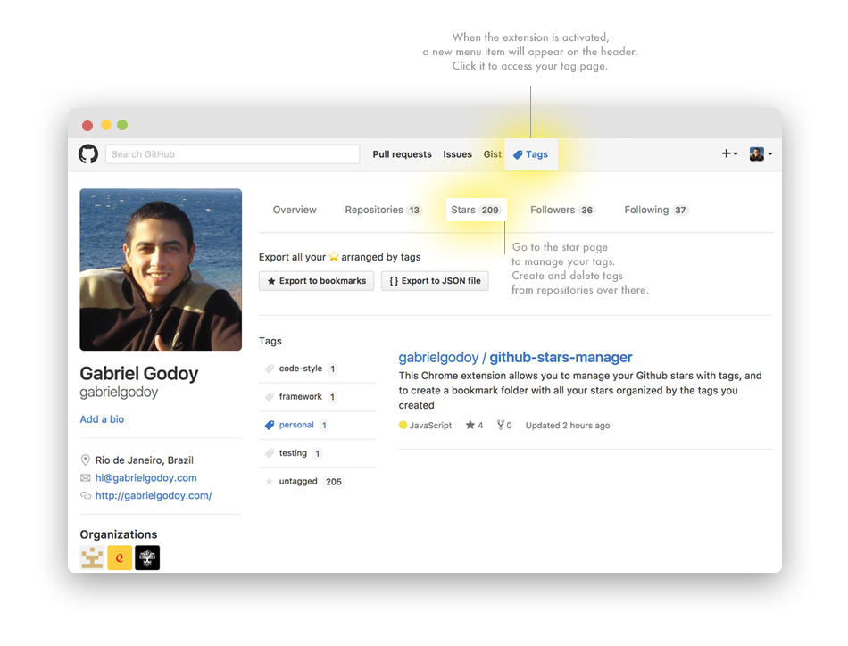

This extension allows you to organize your Github stars with tags. 

You can then export those tags that you created to bookmarks in your Chrome browser or to a JSON file.

## Installation

You can download the extension [here](https://chrome.google.com/webstore/detail/github-stars-manager/epooeampfghdkampjnocabjniefmnkab)

✨ Now you can also manage your tags inside the custom tag page ✨ 

### Storage

The extension uses [storage.sync](https://developer.chrome.com/extensions/storage#property-sync) from Chrome API. The stored data of your github stars will **automatically be synced to any Desktop Chrome browser** that you are logged into, provided that you have sync enabled.

## License

[MIT License](https://gabrielgodoy.mit-license.org/license.html) @ [Gabriel Godoy](https://github.com/gabrielgodoy)
